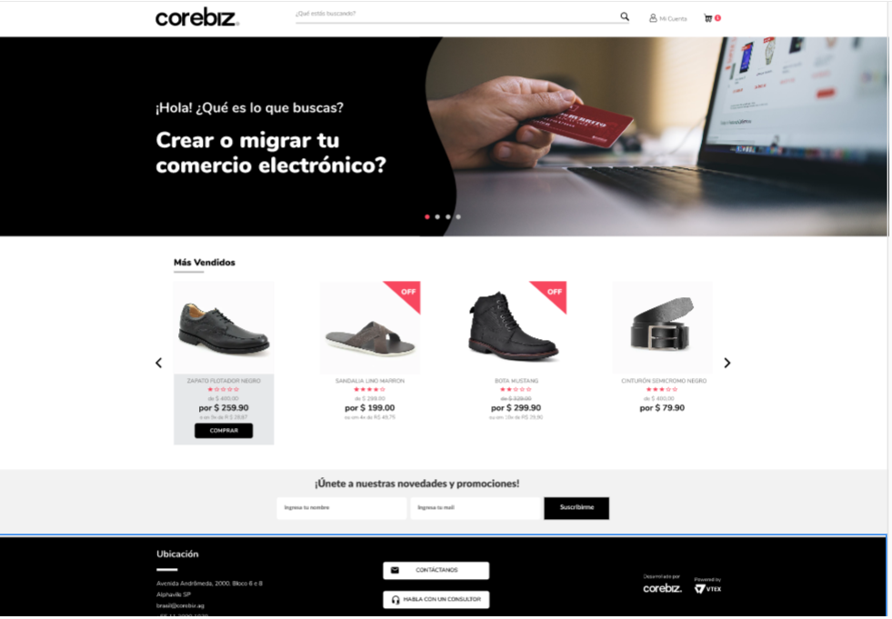

# Test Front-End

E-commerce main page made it for a technical test. React App created with vite.

# Deployment

NETLIFY:

[LINK](https://test-front-end-ecommerce.netlify.app/)

## Screenshots

Desktop version:

Mobile version:

## Libraries and tools

1.  [REACT](https://en.reactjs.org/)
2.  [JEST](https://jestjs.io/)
3.  [TESTING LIBRARY](https://testing-library.com/)
4.  [VITE](https://vitejs.dev/)
5.  [PROPTYPES](https://es.reactjs.org/docs/typechecking-with-proptypes.html)
6.  [AXIOS](https://axios-http.com/)
7.  [React Slick](https://react-slick.neostack.com/)
8.  [MATERIAL UI](https://mui.com/)

## Install and run project

1. Clone repo.
2. cd root directory of the repo folder.
3. Install modules `yarn install`.
4. Run project `yarn dev`.
5. Run tests `yarn test`.
